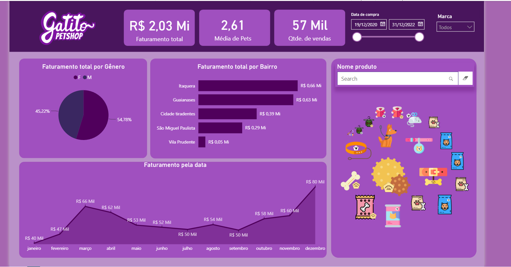
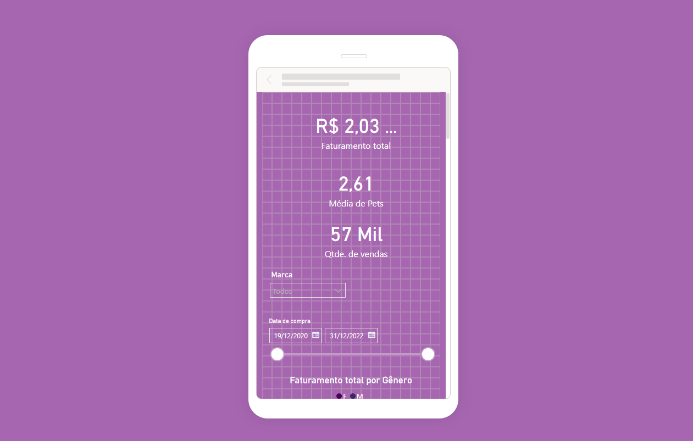

# 🐾 Gatito PetShop — Dashboard de Vendas (Power BI)

Dashboard interativo desenvolvido no **Power BI Desktop** como projeto do curso de Power BI da Alura, analisando as vendas de um petshop fictício.

🔗 **(https://gatito-petshop-dashboard.vercel.app/)**

## Sobre o projeto

O relatório reúne o faturamento, o comportamento de clientes e o catálogo de produtos da Gatito PetShop, com filtros por marca e por período de compra.

Este projeto simula uma consultoria real: a Helô, proprietária de um petshop, nos contratou para implementar um BI (Business Intelligence) para o negócio dela. A partir disso, passamos por todo o processo de construção de um dashboard do zero.

## O que aprendemos

Conhecemos o processo completo de BI e o conceito de **Business Intelligence**, além do fluxo de **ETL** (Extract, Transform and Load) — extrair os dados, tratar os dados disponibilizados e fazer o carregamento deles.

A partir daí, começamos a trabalhar com as métricas: fizemos uma entrevista com a Helô para entender o que era mais importante para ela visualizar, importamos os dados no Power BI, aplicamos os principais tratamentos e construímos as métricas do zero. Por fim, estilizamos tudo até chegar no dashboard final.

**Principais números:**
- Faturamento total: R$ 2,03 Mi
- Média de pets por cliente: 2,61
- Quantidade de vendas: 57 mil

## Prints

### Dashboard (desktop)

### Layout mobile

## Principais insights

- Faturamento quase dividido entre gêneros (54,78% M / 45,22% F)
- Itaquera e Guaianases concentram o maior faturamento por bairro
- Vendas mensais crescem ao longo do ano, de R$ 40 Mil (janeiro) a R$ 80 Mil (dezembro)

## Tecnologias

- Power BI Desktop
- DAX
- Power Query
- Modelagem de dados

## Como abrir o projeto

1. Baixe o arquivo [`gatito-petshop.pbix`](./gatito-petshop.pbix) deste repositório
2. Abra no [Power BI Desktop](https://powerbi.microsoft.com/desktop/) (gratuito)
3. Use os filtros de marca e data para explorar os dados interativamente

---

Projeto feito por Laryssa como parte do curso de Power BI da Alura.
